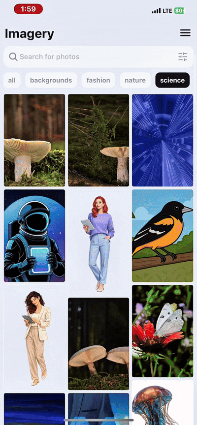
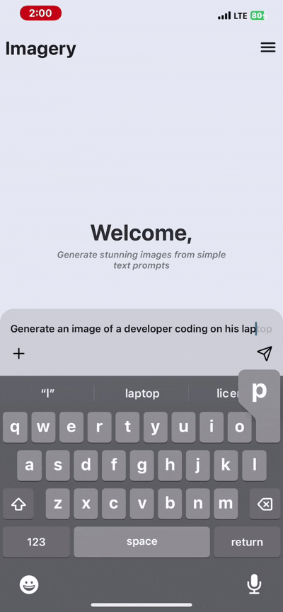
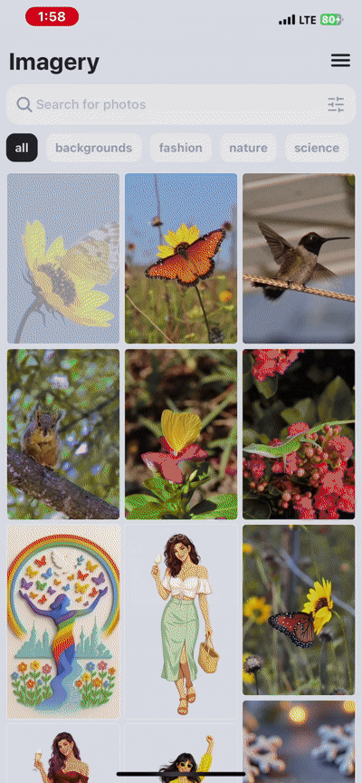
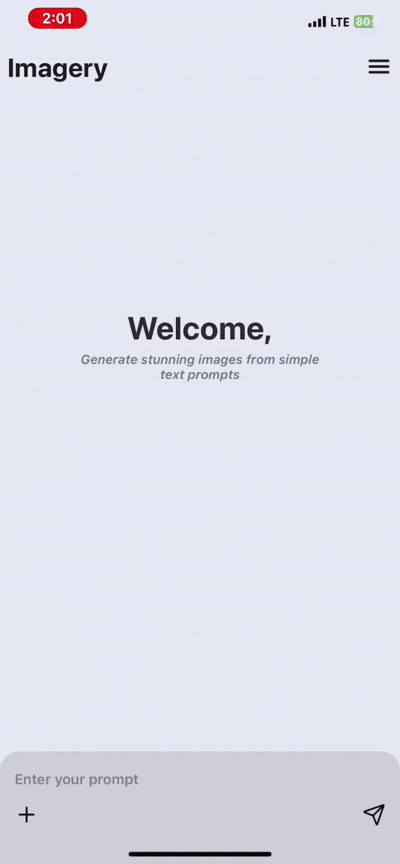
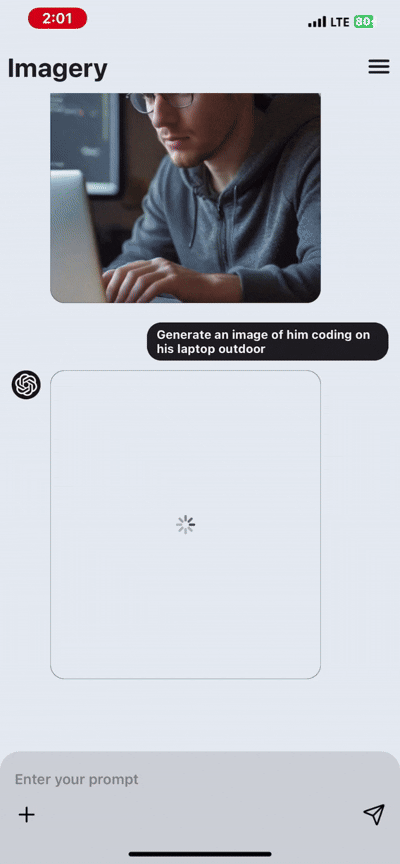
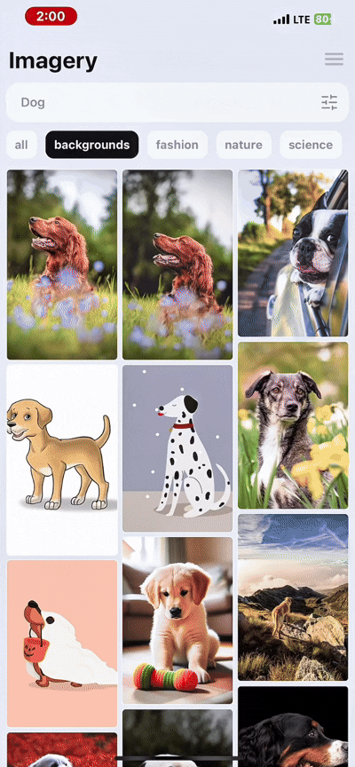

# Imagery

A modern image search and generation mobile app built with **Expo** and **React Native**.
Imagery started as a learning project, but I tried to build it like a real app... clean structure, smooth UI, and features that actually work together instead of feeling stitched on.

---

## What the App Does

When you open the app, you land on an image grid that loads images in a masonry layout..

You can search for images by text, pick a category, and apply filters like image type or color and they all work together.  
For example... search for **cats**, set the type to **illustration**, choose a color and you’ll only get results that match everything.

This is all powered by the Pixabay API.

---

## Image Viewer

tapping an image card opens a full screen viewer where you can:

- Zoom into the image
- Download it to your device
- Share it with other apps

---

## Image GPT

The app also includes an **Image GPT** screen where you can generate images by typing prompts.

Generated images open in the same viewer, so you can zoom, download, or share them just like normal images.

Each prompt is saved locally as a thread and your history shows up in the side drawer, similar to how ChatGPT displays past conversations.

---

## Navigation

Imagery uses a simple drawer layout:

- **Explore** –> image search and filters
- **Image GPT** –> prompt-based image generation
- **History** –> saved image generation threads

The drawer also includes a quick search input so you can search images from anywhere.

---

## Tech Stack

- React Native
- Expo
- Expo Router
- RN Reanimated for animations
- Pixabay API
- Image GPT API

---

## gifs --> Demos

  
  
  
  

  
  
  
  

---

## Notes

This project was mainly built to practice:

- Search + filter logic
- Image & animation heavy UI performance
- App structure and navigation
- Working with external APIs in a real app setup
- Scalable project
